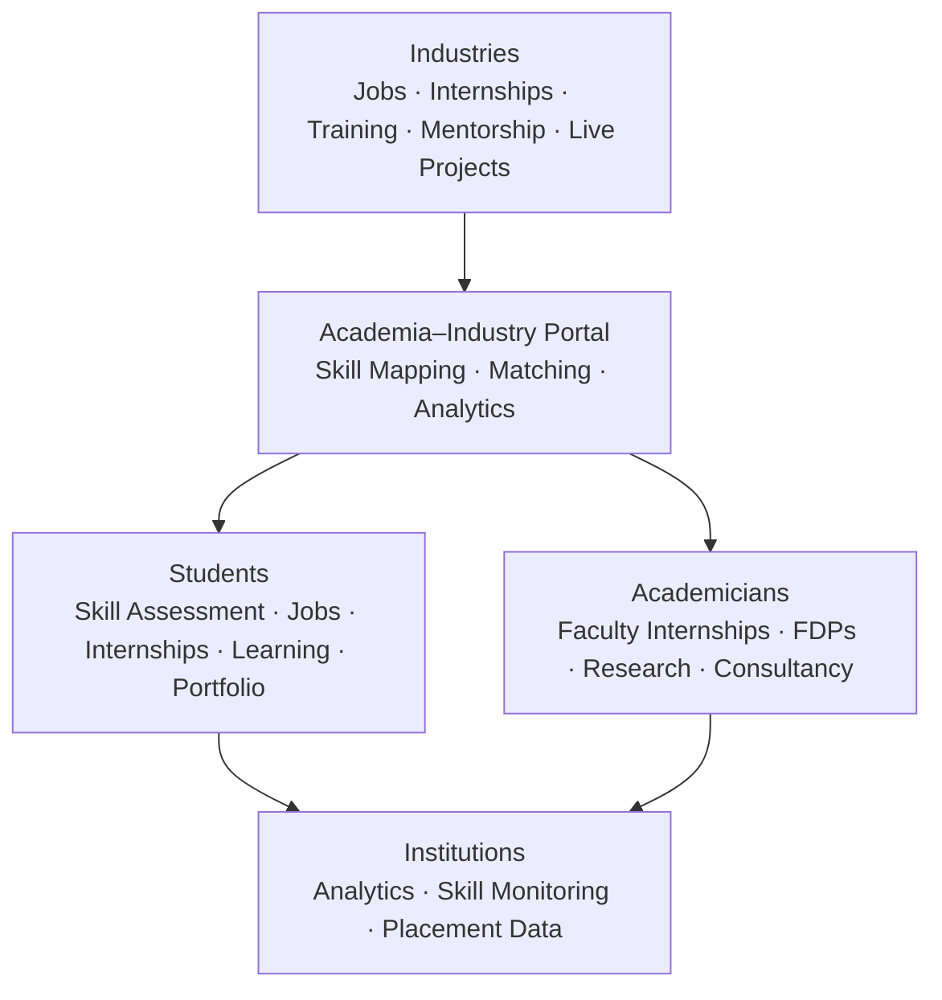
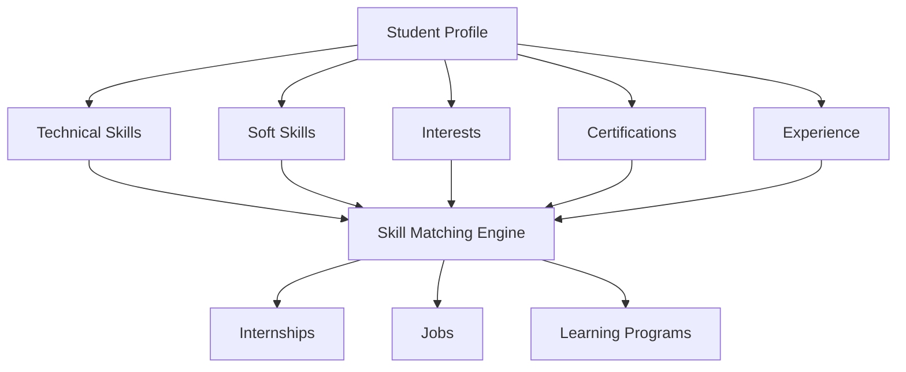
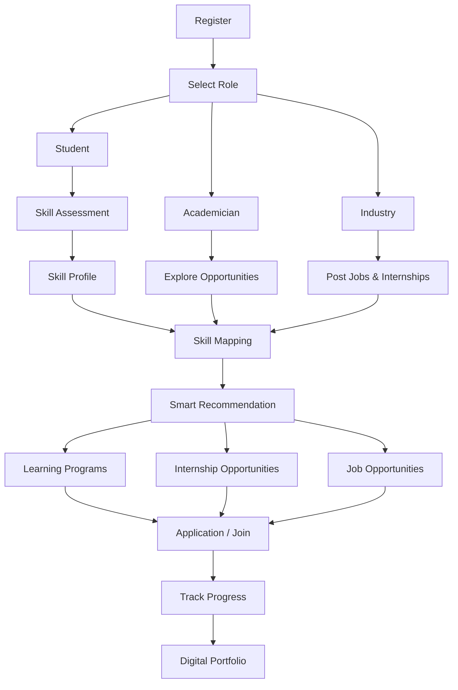
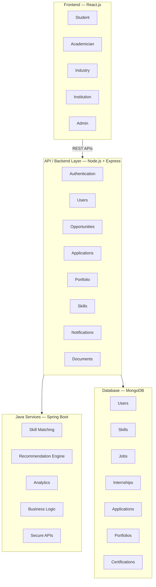
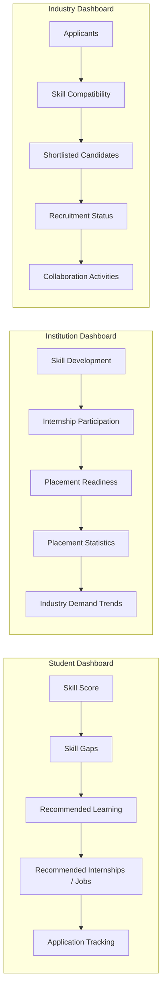
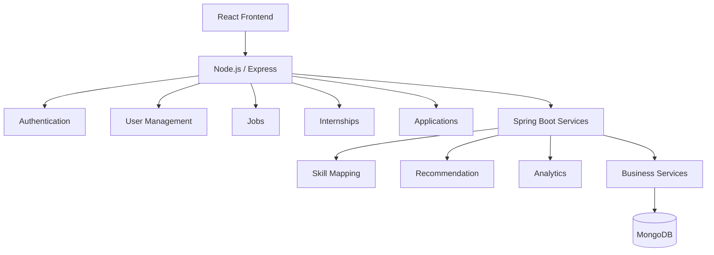
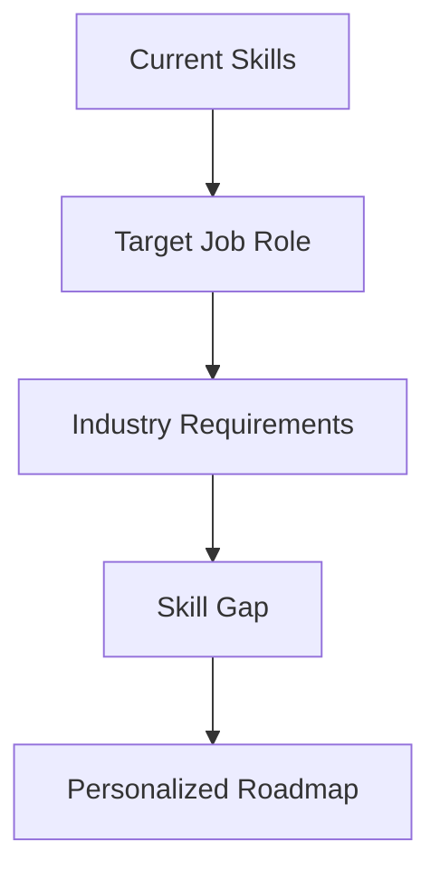
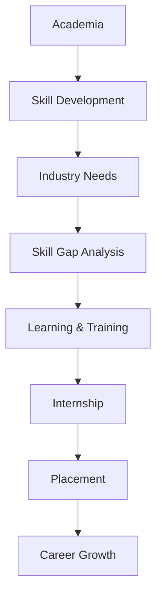

# Academia–Industry Collaboration Portal

<p align="center">
  
  
  
  
  
</p>

<p align="center">
  <b>Bridging the Gap Between Academia, Students & Industry</b>
</p>

<p align="center">
  A unified platform for skill mapping, career development, internships, placements, learning programs, and academia–industry collaboration.
</p>

---

## Smart India Hackathon

**Problem Statement ID:** `SIH26044`

**Title:** Portal for Academia–Industry Collaboration for Skill Mapping, Internships and Placement

| Field | Detail |
|---|---|
| Organization | Ministry of Ayush |
| Department | All India Institute of Ayurveda |
| Category | Software |
| Theme | Smart Automation |

---

## Overview

The **Academia–Industry Collaboration Portal** is a centralized platform connecting **Students, Academicians, Institutions, and Industries** on a single ecosystem.

There is a growing gap between the skills students acquire through academic education and the skills demanded by modern industries. Students often struggle to identify which skills their desired career paths require, while companies face difficulty discovering candidates with the right skill sets. Academicians and institutions, in turn, often have limited access to industry internships, training programs, mentorship, and research collaborations.

This platform creates a unified ecosystem where:

> Students discover → Skills are assessed → Skill gaps are identified → Opportunities are matched → Skills are developed → Internships & placements are achieved.

---

## Problem We Are Solving

**For Students**
- Difficulty identifying industry-relevant skills
- Lack of personalized career guidance
- Limited access to relevant internships
- Scattered job and placement opportunities
- Difficulty tracking applications
- No centralized professional portfolio

**For Industries**
- Difficulty finding candidates with relevant skills
- Inefficient candidate discovery
- Limited collaboration with academic institutions
- Lack of an efficient skill-based recruitment ecosystem

**For Academicians**
- Limited access to industry opportunities and FDPs
- Difficulty discovering faculty internships
- Limited research and consultancy collaboration

**For Institutions**
- Difficulty monitoring student skill development
- Fragmented internship and placement data
- Limited visibility into industry skill demands
- Lack of centralized analytics

---

## Our Solution

The portal brings all stakeholders together through a single role-based platform.



---

## Core Features

### Student Module

**Skill Assessment**
Students evaluate technical and soft skills through structured questionnaires, generating a personalized profile covering strengths, skill gaps, career interests, and industry readiness.

**Skill Mapping**
Student skills are mapped against industry requirements to surface relevant job roles, industries, learning programs, certifications, internships, and placement opportunities.

**Internship & Job Opportunities**
Search, filter, apply, and track applications across internships and jobs, with personalized recommendations.

**Learning & Training**
Discover industry-relevant training programs, certification courses, workshops, and mentorship programs.

**Digital Portfolio**
A professional portfolio combining profile, skills, certifications, projects, internships, achievements, resume, and academic information.

### Industry Module

Industries manage an organization profile and publish:
- Jobs, internships, and apprenticeships
- Live projects
- Training and certification programs
- Workshops and mentorship programs

**Benefits:** skill-based candidate discovery, shortlisting, recruitment management, and direct academia collaboration.

### Academician Module

Academicians can discover and participate in:
- Faculty internships and industrial training
- Faculty Development Programs (FDPs)
- Consultancy and collaborative research
- Industry mentorship, workshops, and guest lectures

### Institution Module

Institutions get centralized dashboards to monitor:
- Student skill development and skill gaps
- Internship participation and placement readiness
- Recruitment outcomes and industry skill demand

---

## Intelligent Skill & Opportunity Matching



The matching engine reduces the gap between what a student knows and what the industry requires.

---

## Complete Platform Workflow



---

## Technology Stack

**Frontend**
- React.js, HTML5, CSS3, JavaScript
- Responsive UI

**Backend — hybrid architecture**

*MERN stack*
- Node.js, Express.js, REST APIs

*Java backend*
- Java, Spring Boot, Spring Web, Spring Security, RESTful APIs

**Database**
- MongoDB, Mongoose

**Authentication & Security**
- Role-Based Access Control, JWT-based authentication
- Password hashing, protected APIs, input validation
- Secure document handling

**Development Tools**
- Git, GitHub, VS Code, Postman, MongoDB Compass

---

## High-Level Architecture



---

## Project Structure

```text
academia-industry-portal/
├── frontend/
│   ├── public/
│   └── src/
│       ├── components/
│       ├── pages/
│       ├── layouts/
│       ├── services/
│       ├── hooks/
│       ├── context/
│       ├── utils/
│       └── App.jsx
│
├── node-backend/
│   ├── controllers/
│   ├── models/
│   ├── routes/
│   ├── middleware/
│   ├── services/
│   ├── utils/
│   └── server.js
│
├── spring-backend/
│   └── src/main/
│       ├── java/com/academia/
│       │   ├── controller/
│       │   ├── service/
│       │   ├── repository/
│       │   ├── model/
│       │   ├── security/
│       │   └── config/
│       └── resources/
│           └── application.properties
│
├── docs/
├── screenshots/
├── .gitignore
├── README.md
└── LICENSE
```

---

## Security

The platform handles student, academic, and professional information, so security is a first-class concern:

- Secure authentication and password encryption
- Role-based authorization
- JWT-based access control
- Protected API endpoints and server-side validation
- Secure document management
- Environment-based secret management

---

## Analytics & Dashboards



---

## Major Modules

| Module | Student | Academician | Industry | Institution |
|---|:---:|:---:|:---:|:---:|
| Profile | Yes | Yes | Yes | Yes |
| Skill Assessment | Yes | — | — | Yes |
| Skill Mapping | Yes | — | Yes | Yes |
| Jobs | Yes | — | Yes | Yes |
| Internships | Yes | Yes | Yes | Yes |
| Learning Programs | Yes | Yes | Yes | Yes |
| Mentorship | Yes | Yes | Yes | Yes |
| Research Collaboration | — | Yes | Yes | Yes |
| Digital Portfolio | Yes | — | — | — |
| Analytics | Yes | Yes | Yes | Yes |
| Application Tracking | Yes | — | Yes | Yes |

---

## Installation & Setup

### Prerequisites
- Node.js and npm
- Java JDK
- Maven
- MongoDB
- Git

### 1. Clone the Repository

```bash
git clone https://github.com/YOUR-USERNAME/YOUR-REPOSITORY.git
cd academia-industry-portal
```

### 2. Setup Frontend

```bash
cd frontend
npm install
npm run dev
```

### 3. Setup Node.js Backend

```bash
cd node-backend
npm install
npm run dev
```

### 4. Setup Spring Boot Backend

```bash
cd spring-backend
mvn clean install
mvn spring-boot:run
```

### 5. Configure Environment Variables

Create `.env` files according to your environment:

```env
PORT=5000
MONGODB_URI=your_mongodb_connection_string
JWT_SECRET=your_jwt_secret
SPRING_BOOT_URL=http://localhost:8080
```

> Never commit real credentials, API keys, or secrets to GitHub.

---

## API Architecture



---

## Screenshots

> Screenshots will be added as the application development progresses.

| | |
|---|---|
| **Landing Page** | `./screenshots/home.png` |
| **Student Dashboard** | `./screenshots/student-dashboard.png` |
| **Skill Assessment** | `./screenshots/skill-assessment.png` |
| **Internship & Job Portal** | `./screenshots/opportunities.png` |
| **Industry Dashboard** | `./screenshots/industry-dashboard.png` |
| **Institution Analytics** | `./screenshots/analytics.png` |

---

## Future Enhancements

**AI-Powered Career Assistant** — career guidance, skill recommendations, resume improvement, interview preparation, and roadmap generation.

**Advanced Skill Gap Analysis**



**Intelligent Candidate Matching** — compatibility scoring across skills, experience, certifications, interests, and qualifications.

**Predictive Analytics** — forecasting placement readiness, emerging industry skills, and recruitment trends.

**External Integrations** — learning platforms, certification providers, institutional databases, recruitment platforms, and digital credential providers.

---

## Expected Impact

**Students** — better career clarity, industry-relevant skill development, easier internship discovery, improved placement readiness, professional digital identity.

**Industries** — faster candidate discovery, skill-based recruitment, better internship management, stronger academia partnerships.

**Academicians** — industry exposure, faculty internships, FDP opportunities, research collaboration, mentorship.

**Institutions** — centralized student analytics, better placement monitoring, industry-aligned skill development, data-driven decision making.

---

## Alignment With SIH26044

| SIH Requirement | Covered |
|---|:---:|
| Skill Assessment | Yes |
| Skill Profiling | Yes |
| Skill Gap Identification | Yes |
| Skill Mapping | Yes |
| Career Guidance | Yes |
| Learning Recommendations | Yes |
| Industry Training | Yes |
| Internship Portal & Matching | Yes |
| Internship Tracking | Yes |
| Placement Portal & Candidate Matching | Yes |
| Recruitment Management | Yes |
| Faculty Internships & FDPs | Yes |
| Industry Mentorship & Live Projects | Yes |
| Research Collaboration | Yes |
| Digital Student Portfolio | Yes |
| Institution Analytics | Yes |
| Role-Based Access | Yes |
| Secure Document Management | Yes |

---

## Design Philosophy

1. **Skill First** — opportunities driven by skills and competencies, not just academic qualifications.
2. **Collaboration First** — students, academicians, institutions, and industries within one connected ecosystem.
3. **Data Driven** — meaningful analytics for institutions and industries.
4. **Career Oriented** — improving student employability and industry readiness.

---

## Hackathon Objective

This project is developed as a solution for **Smart India Hackathon Problem Statement SIH26044**, building a scalable digital ecosystem that turns the traditional academia–industry relationship into continuous collaboration.



---

## Team

| Member | Role |
|---|---|
| [Your Name] | Full Stack Developer |
| [Member Name] | Backend Developer |
| [Member Name] | Frontend Developer |
| [Member Name] | UI/UX Designer |
| [Member Name] | Research / Documentation |
| [Member Name] | AI / Data / Integration |

---

## Contribution

Contributions, suggestions, and improvements are welcome.

```bash
# Clone repository
git clone https://github.com/CHETAN-PATEL-1/Brute-Force-2026.git

# Create a feature branch
git checkout -b feature/your-feature

# Make your changes, then commit
git add .
git commit -m "Add: your feature"

# Push and open a Pull Request
git push origin feature/your-feature
```

---

## License

This project is developed as part of the Smart India Hackathon. Licensing terms can be updated according to final project requirements.

---

## Support the Project

If you find this project interesting, consider giving the repository a star.

<p align="center">
<b>Connecting Skills With Opportunities</b><br/>
Empowering Students · Enabling Industries · Strengthening Academia<br/><br/>
<b>SIH26044 | Skill-GenZ</b>
</p>